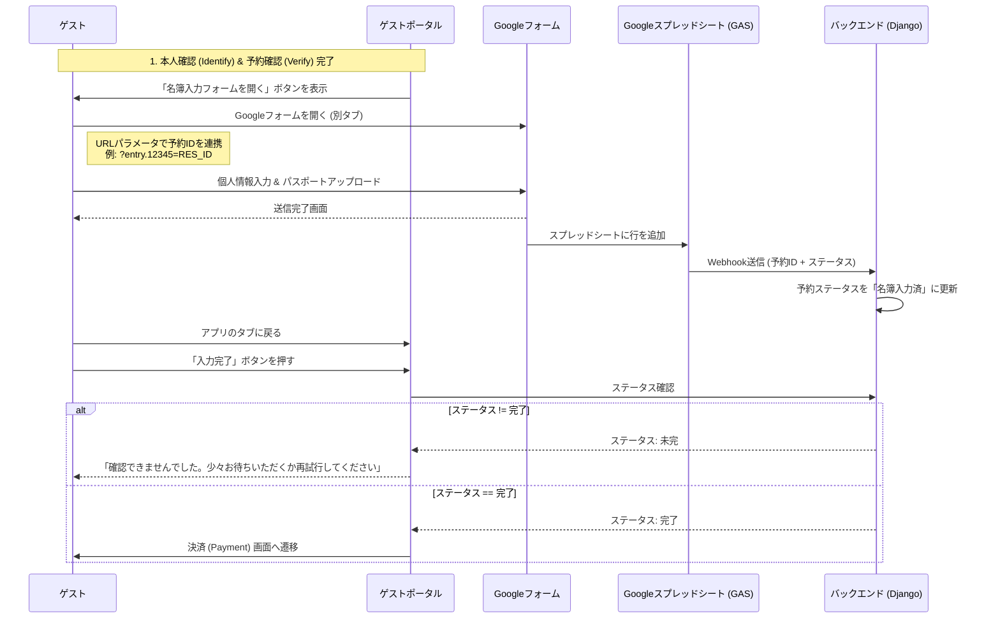

# Googleフォーム統合戦略

## 概要
開発コストを最小限に抑え、既存の業務フローを活用するため、宿泊者名簿（レジスターカード）の入力プロセスをGoogleフォームに移行します。ゲストポータルはユーザーをフォームへ誘導し、API経由で入力完了を確認してから決済へ進みます。

## アーキテクチャ

## 実装詳細

### フロントエンド (ゲストポータル)
- **名簿入力ステップ (Register Step)**:
    - 既存の入力フォームを削除。
    - 「登録フォームへ移動」する外部リンクボタンを追加。
    - GoogleフォームのURLに予約IDをプレフィルパラメータとして付与。
    - ステータスをポーリング/確認するための「完了確認」ボタンを追加。

### バックエンド (Django) - *今後実装予定*
- **Webhook エンドポイント**: GASからのペイロードを受信する。
- **ステータス API**: 現在のフラグ `is_guest_info_submitted` を返す。

### Google 側 (GAS)
- **トリガー**: フォーム送信時。
- **スクリプト**: DjangoのWebhookに対して予約IDを含むHTTP POSTリクエストを送信する。
